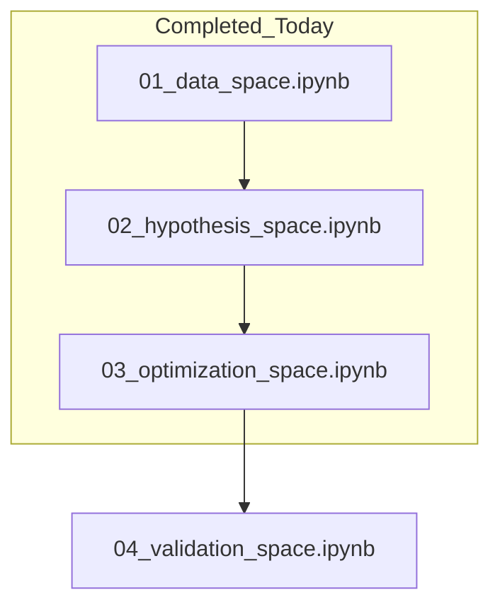

# Workshop 2 Session Context

## 🗺️ Context Map
Current work focused on the first three modules of the MLAI Workshop series, exploring the fundamental "Spaces" of machine learning.

### 📋 Context Bundle Log

| Notebook | Focus | Key Additions |
| --- | --- | --- |
| `01_data_space.ipynb` | Data Observability | Execution & initial AI summaries. |
| `02_hypothesis_space.ipynb` | Hypothesis Space & Activations | Demo cells for `tanh`/`linear` activations; 3Blue1Brown ReLU theory link. |
| `03_optimization_space.ipynb` | Selection & Training Path | AI Analysis sections 4-12; Import fixes. |

### 🛠️ Verification Trace
- [x] Environment configured via `uv`
- [x] Notebook 01 executed and annotated
- [x] Notebook 02 executed and annotated (Activation deep dive)
- [x] Notebook 03 executed and annotated (Optimization limits)
- [x] Setup cell linter errors resolved in Notebook 03
